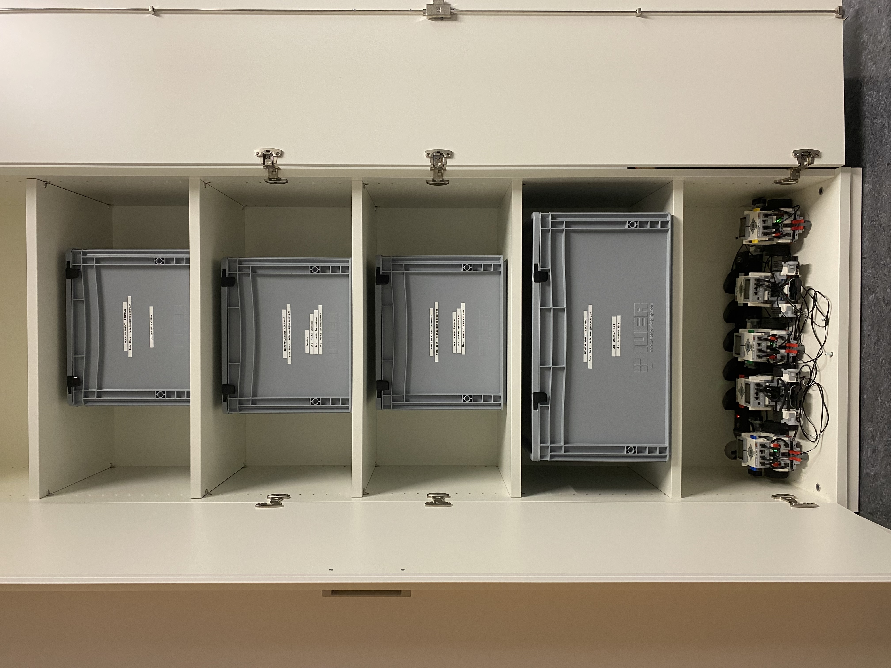
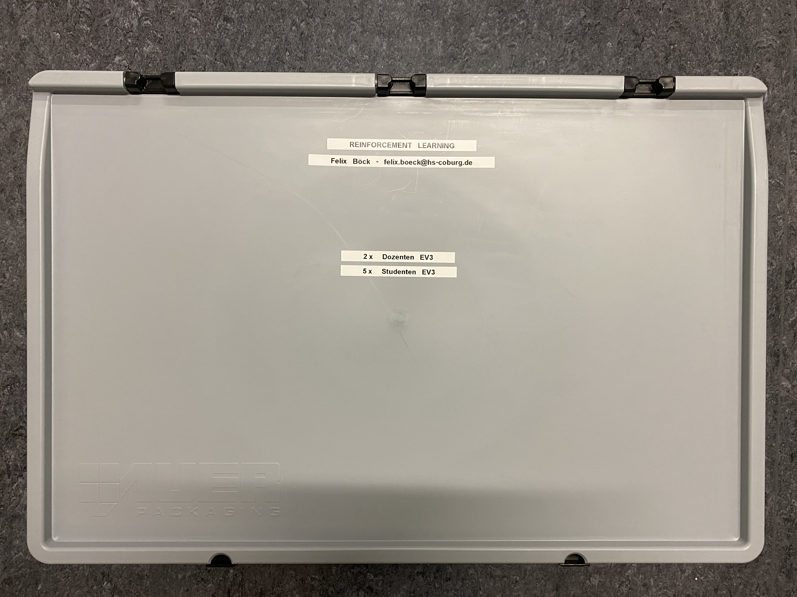
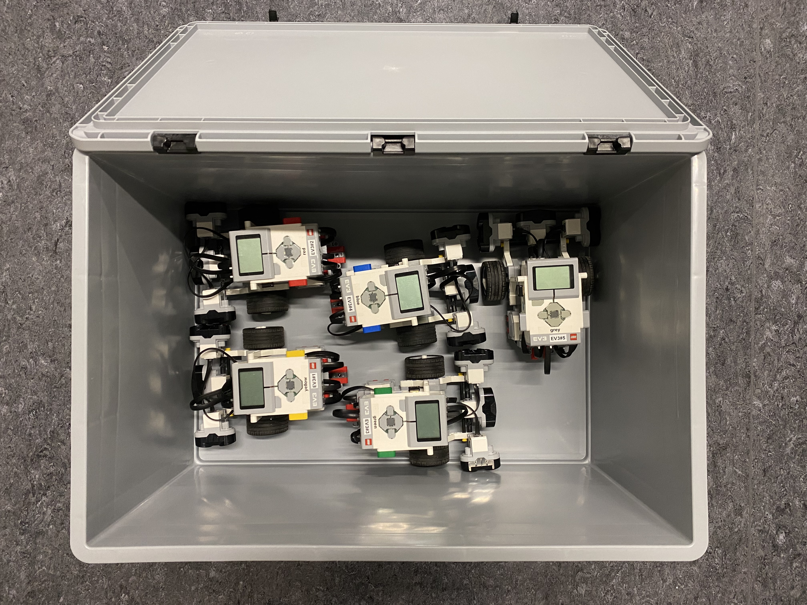
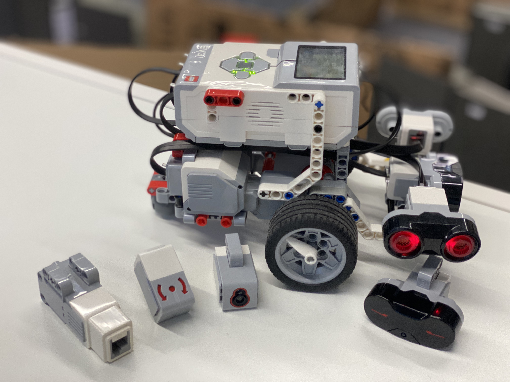
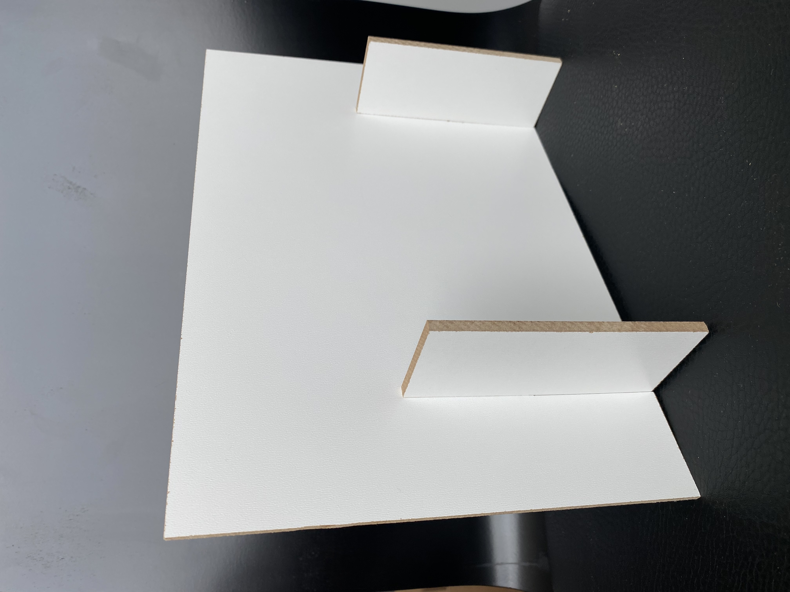

# Equipment

---

## List of contents

* [Overview](#overview)
  * [Classroom Sorting](#classroom-sorting)
  * [EV3 Equipment](#ev3-equipment)
  * [Building Components](#building-components)

---

## Overview

> **WICHTIG:**  
> Nach den Präsenzveranstaltungen sind die Materialien wieder so zu hinterlassen bzw. aufzuräumen, wie diese vorgefunden wurden!  
  *Aus den Bildern unten können Sie die Struktur entnehmen.*

---

### Classroom Sorting

* Locker Overview   
   

* EV3 Overview   
  
  

* Building Components Overview   
  
  

---

### EV3 Equipment

* EV3 Overview   
 

* EV3 Components   
 

---

### Building Components

* Building Block Element   
 

* Building Components   
 